Project 8 — Real-Time Sales Data Pipeline with Apache Kafka & AWS

\

  \<strong>Daniel Ruiz Lopez\</strong>\ 

  Junior Data Engineer

\

\

  \<a href="https\://www\.linkedin.com/in/danielruizl/">LinkedIn\</a> |

  \<a href="https\://github.com/danielruiz501">GitHub\</a> |

  \<a href="mailto\:danielruizlopez889\@gmail.com">Email\</a>

\

\

  \

  \

  \

  \

  \

  \

  \

\

Overview

This project implements an end-to-end real-time sales data pipeline using Apache Kafka and AWS.

The pipeline simulates streaming e-commerce sales events from a synthetic dataset, publishes them to an Apache Kafka topic, consumes the events with Python, stores raw JSON data in Amazon S3, transforms the data with AWS Glue, stores the processed data as compressed Parquet, and enables analytical SQL queries with Amazon Athena.

Dataset note: The sales dataset used in this project is synthetic and was generated specifically to simulate e-commerce transactions for learning and portfolio purposes.

Architecture

![Architecture]\(architecture/architecture.png)

Pipeline

Synthetic Sales Data

        ↓

Python Kafka Producer

        ↓

Apache Kafka

        ↓

Python Kafka Consumer

        ↓

Amazon S3 - Raw JSON

        ↓

AWS Glue ETL

        ↓

Amazon S3 - Processed Parquet

        ↓

AWS Glue Data Catalog

        ↓

Amazon Athena

        ↓

SQL Analytics

Technologies

Python

Apache Kafka 4.1.2

Amazon EC2

Amazon S3

AWS Glue

AWS Glue Data Catalog

Amazon Athena

Amazon CloudWatch

AWS IAM

Git & GitHub

AWS Architecture

Amazon EC2

An Amazon EC2 instance was used to host:

Apache Kafka

Kafka topic sales-events

Python Kafka Producer

Python Kafka Consumer

Kafka was configured using KRaft mode with separate internal and external listeners.

Apache Kafka

Kafka topic:

sales-events

The topic was configured with:

Partitions: 3

Replication factor: 1

The Python Producer publishes sales events as JSON messages.

Amazon S3

S3 was used as the project's data lake.

s3://daniel-kafka-sales-pipeline-8/

│

├── raw/

│   ├── ORD-100315.json

│   ├── ORD-100802.json

│   ├── ORD-102074.json

│   ├── ORD-104806.json

│   └── ORD-104950.json

│

└── processed/

    └── \*.snappy.parquet

The raw zone stores the original streaming events as JSON.

The processed zone stores transformed data in Parquet format using Snappy compression.

AWS Glue

AWS Glue was used for:

Data Catalog

Schema discovery

ETL processing

Data type transformation

Parquet generation

The ETL transformation converted:

quantity       VARCHAR → INTEGER

unit\_price     VARCHAR → DOUBLE

total\_amount   VARCHAR → DOUBLE

Amazon Athena

Athena was used to query the processed Parquet data using SQL.

Because the ETL converted the numeric fields to appropriate numeric types, analytical queries can use functions such as SUM() without requiring repeated CAST() operations.

Data Flow

1\. Data Generation

A synthetic e-commerce sales dataset containing 10,000 records was generated in CSV format.

Main fields include:

order\_id

customer\_id

product\_id

product\_name

category

quantity

unit\_price

total\_amount

country

payment\_method

order\_status

order\_timestamp

2\. Kafka Producer

The Python Producer reads the CSV and publishes sales events to:

sales-events

Example event:

{

  "order\_id": "ORD-100315",

  "customer\_id": "CUST-12365",

  "product\_id": "PROD-1145",

  "product\_name": "Jeans",

  "category": "Apparel",

  "quantity": "2",

  "unit\_price": "91.97",

  "total\_amount": "183.94",

  "country": "Mexico",

  "payment\_method": "Credit Card",

  "order\_status": "Completed",

  "order\_timestamp": "2026-01-01 02:01:10"

}

3\. Kafka Consumer

The Python Consumer:

Reads messages from Kafka

Validates JSON events

Skips invalid events

Extracts order\_id

Writes valid events to S3

Uses the EC2 IAM role instead of hard-coded AWS credentials

4\. Raw Data Layer

Valid Kafka events are stored in:

s3://daniel-kafka-sales-pipeline-8/raw/

5\. Glue ETL

AWS Glue reads the raw JSON data and transforms numeric fields into appropriate data types.

The processed data is written to:

s3://daniel-kafka-sales-pipeline-8/processed/

as:

Parquet + Snappy

6\. Data Catalog

AWS Glue Crawlers discover the schemas for both layers.

Glue database:

kafka\_sales\_db

Tables:

raw

processed

7\. Athena Analytics

Amazon Athena queries the processed data directly from S3.

SQL Analytics

The project includes analytical queries for:

Sales by Category

SELECT

    category,

    COUNT(\*) AS total\_orders,

    SUM(total\_amount) AS total\_sales

FROM processed

GROUP BY category

ORDER BY total\_sales DESC;

Units Sold and Sales by Category

SELECT

    category,

    SUM(quantity) AS units\_sold,

    SUM(total\_amount) AS total\_sales

FROM processed

GROUP BY category

ORDER BY total\_sales DESC;

Sales by Country

SELECT

    country,

    COUNT(\*) AS total\_orders,

    SUM(total\_amount) AS total\_sales

FROM processed

GROUP BY country

ORDER BY total\_sales DESC;

Top Products

SELECT

    product\_name,

    category,

    SUM(quantity) AS units\_sold,

    SUM(total\_amount) AS total\_sales

FROM processed

GROUP BY product\_name, category

ORDER BY units\_sold DESC, total\_sales DESC;

Sales by Order Status

SELECT

    order\_status,

    COUNT(\*) AS total\_orders,

    SUM(total\_amount) AS total\_sales

FROM processed

GROUP BY order\_status

ORDER BY total\_sales DESC;

Project Results

The pipeline was successfully tested end-to-end.

Validated components:

Kafka broker running successfully

sales-events topic created with 3 partitions

Python Producer successfully published sales events

Python Consumer successfully consumed valid events

Invalid Kafka messages were handled without stopping the Consumer

Valid events were written to S3

AWS Glue ETL successfully transformed the data

Processed data was stored as Snappy-compressed Parquet

Glue Data Catalog successfully created raw and processed tables

Athena successfully queried the processed Parquet data

Analytical SQL queries executed successfully

Data Quality Handling

During development, the Consumer encountered non-JSON test messages that had been previously inserted into the Kafka topic.

The Consumer was updated to handle invalid JSON events gracefully:

Invalid event

     ↓

JSON validation

     ↓

Skip event

     ↓

Continue consuming valid events

This prevents a malformed message from terminating the streaming Consumer.

IAM and Security

The project follows the principle of least privilege where practical.

The EC2 application uses an IAM role to access S3 instead of storing AWS access keys inside the Python code.

The Kafka external listener was restricted through the EC2 Security Group rather than being exposed to the entire internet.

No AWS credentials, private keys, or .env files are stored in this repository.

Project Structure

aws-kafka-real-time-pipeline-8/

│

├── architecture/

│   └── architecture.png

│

├── config/

│   └── config.py

│

├── consumer/

│   └── consumer.py

│

├── data/

│   └── sales\_data.csv

│

├── producer/

│   └── producer.py

│

├── scripts/

│

├── screenshots/

│   ├── athena-processed-analysis.png

│   ├── athena-processed-results.png

│   ├── athena-query-results.png

│   ├── athena-sales-analysis.png

│   ├── athena-sales-by-country.png

│   ├── athena-sales-by-status.png

│   ├── athena-top-products.png

│   ├── glue-etl-processed.png

│   ├── kafka-consumer-s3-upload.png

│   ├── kafka-producer-consumer-test.png

│   ├── kafka-sales-events.png

│   ├── kafka-topic-created.png

│   └── s3-raw-json-validation.png

│

├── sql/

│

├── .gitattributes

├── .gitignore

├── LICENSE

└── README.md

Screenshots

Architecture

Kafka Topic

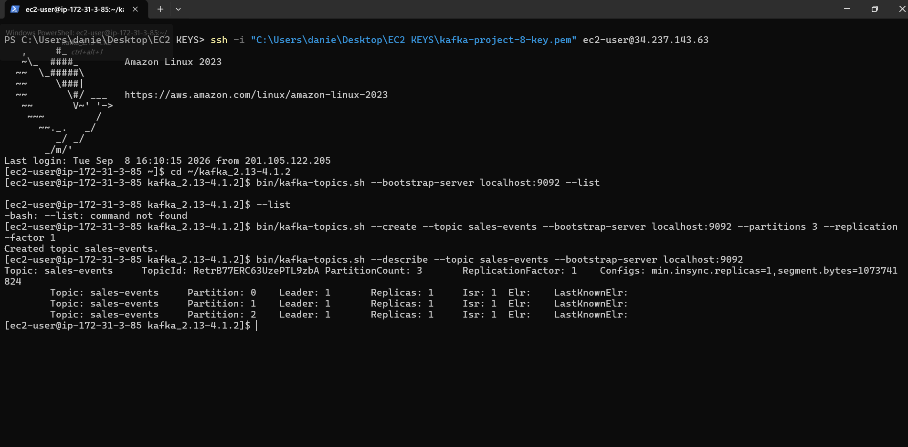
Kafka Producer and Consumer Test

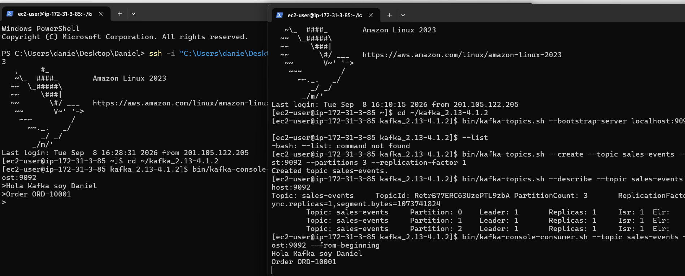
Kafka Sales Events

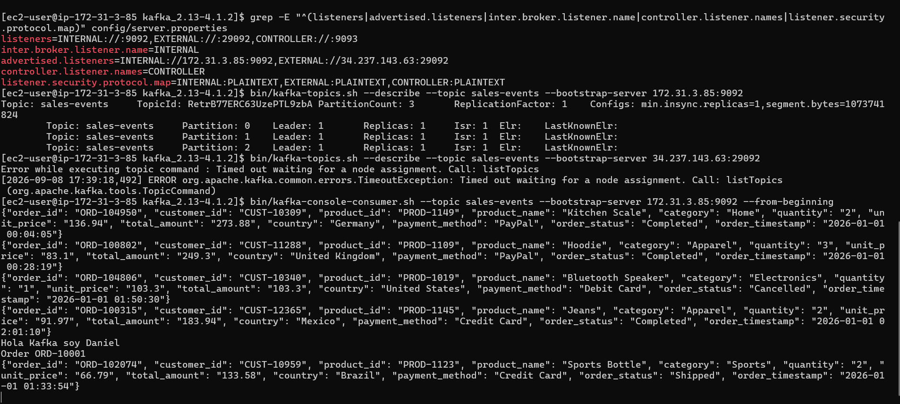
Consumer Uploading Events to S3

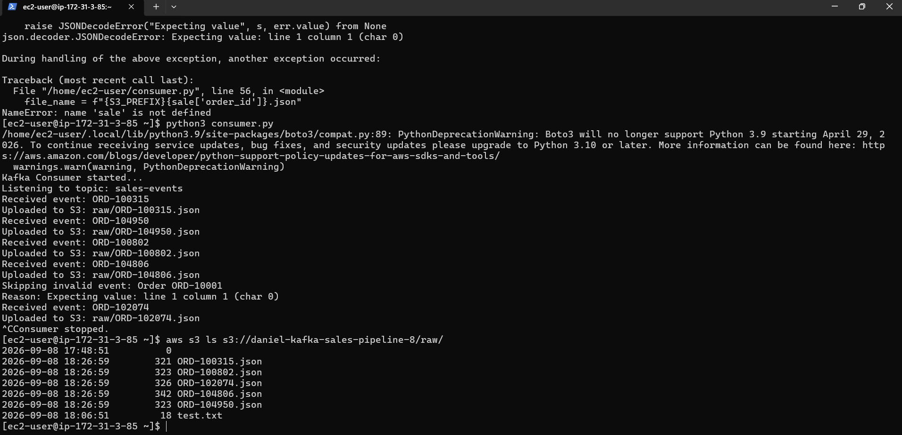
S3 Raw JSON Validation

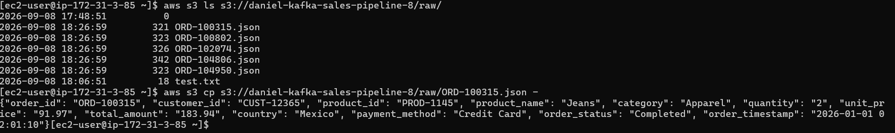
Glue ETL Processed Data

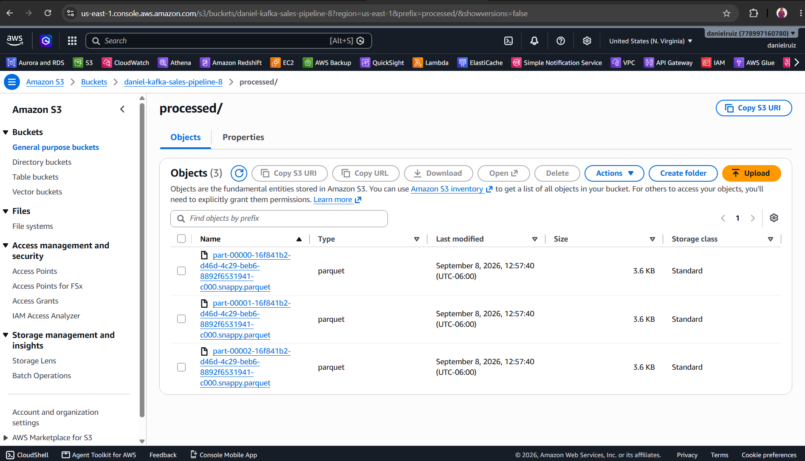
Athena Processed Data

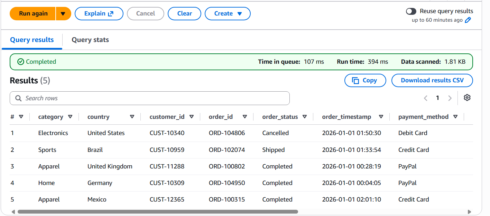
Athena Sales Analysis

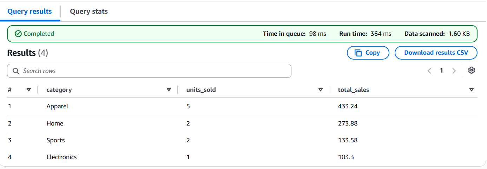
Athena Sales by Country

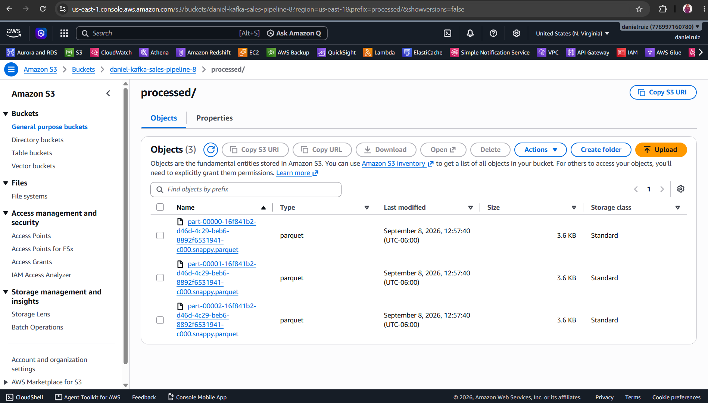
Athena Top Products

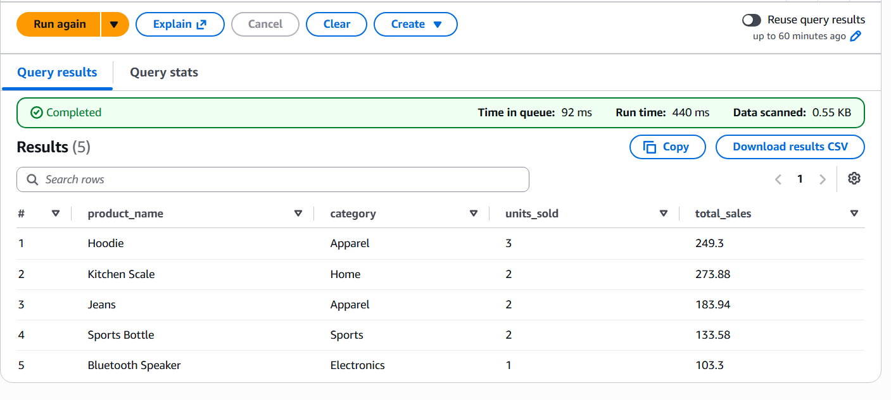
Athena Sales by Status

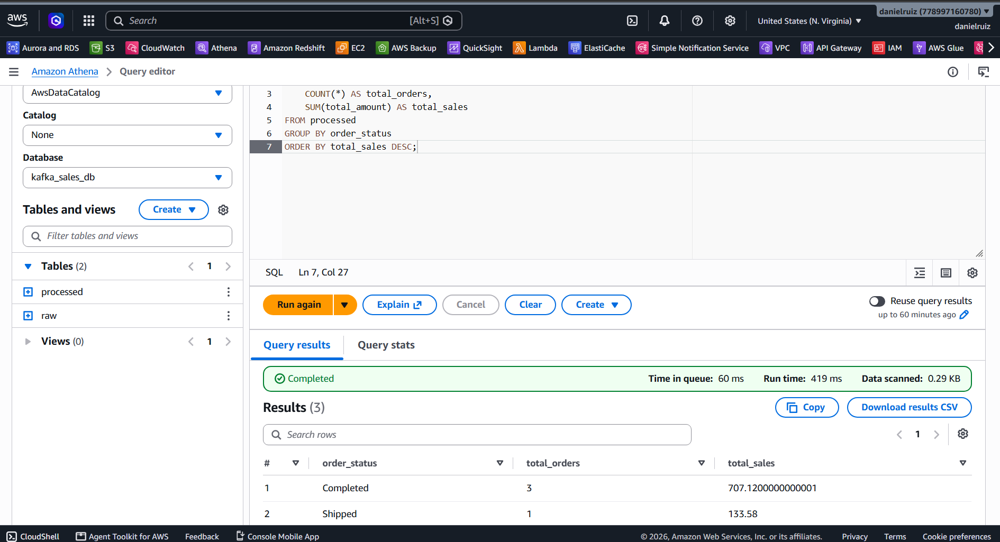
What I Learned

Through this project I practiced:

Apache Kafka fundamentals

Kafka topics and partitions

Kafka Producer and Consumer development with Python

Real-time event streaming concepts

AWS EC2 deployment

Amazon S3 data lake architecture

IAM roles and least-privilege access

AWS Glue Crawlers

AWS Glue ETL with Spark

Data type transformations

Parquet and Snappy compression

AWS Glue Data Catalog

Amazon Athena

Analytical SQL

Handling malformed streaming events

Git and GitHub project organization

Limitations and Future Improvements

This project was designed as a portfolio and learning implementation.

Potential future improvements include:

Kafka replication across multiple brokers

Kafka TLS/SASL authentication

Infrastructure as Code with Terraform

Automated deployment

CI/CD pipeline

Real-time monitoring and alerting with CloudWatch

More advanced data quality validation

Streaming transformations with a dedicated stream-processing framework

Automated Glue job execution

More analytical dashboards using Amazon QuickSight

Status

Completed — End-to-end Kafka + AWS data engineering pipeline

Author

Daniel Ruiz Lopez

Junior Data Engineer

LinkedIn: https\://www\.linkedin.com/in/danielruizl/

GitHub: https\://github.com/danielruiz501

Email: danielruizlopez889\@gmail.com