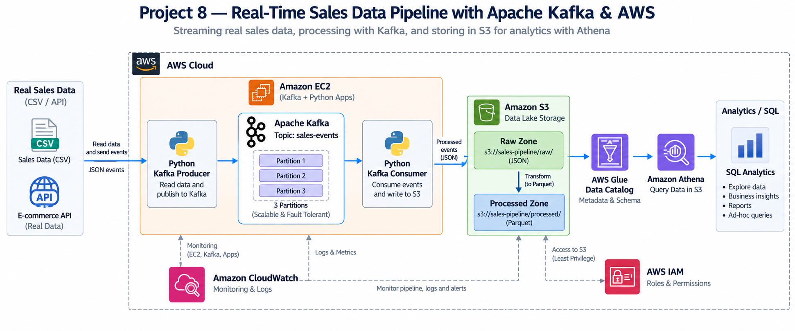

# Project 8 — Real-Time Sales Data Pipeline with Apache Kafka & AWS

## Overview

This project implements a real-time data engineering pipeline using Apache Kafka and AWS.

The pipeline ingests real sales data, publishes events to Kafka, processes streaming data with a Kafka consumer, stores the data in Amazon S3, and enables analytical queries using Amazon Athena.

## Architecture



## Technologies

- Apache Kafka
- Python
- Amazon EC2
- Amazon S3
- AWS Glue
- Amazon Athena
- Amazon CloudWatch
- AWS IAM
- Git & GitHub

## Pipeline

```text
Real Sales Data
      ↓
Python Kafka Producer
      ↓
Apache Kafka
      ↓
Python Kafka Consumer
      ↓
Amazon S3
      ↓
AWS Glue
      ↓
Amazon Athena
      ↓
SQL Analytics
